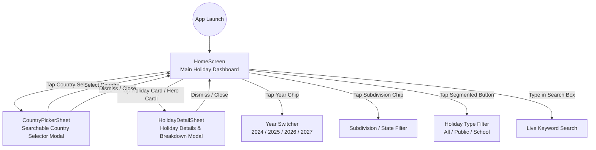

# Phase 3: Screen Inventory

## 1. Screen Catalog

---

## 2. Detailed Screen Specifications

### Screen 1: `HomeScreen` (Main Holiday Dashboard)
- **Feature Area**: Holiday Discovery & Exploration
- **Source Code**: [`HomeScreen.kt`](file:///D:/Android_Workspace/CountryHolidayApp/app/src/main/java/com/ravikant/countryholidayapp/ui/screens/HomeScreen.kt)
- **Purpose**: Primary dashboard presenting the active country selection, upcoming holiday countdown, temporal & classification filters, search input, and scrollable list of filtered holidays.
- **Entry Points**: App Launch via [MainActivity.kt](file:///D:/Android_Workspace/CountryHolidayApp/app/src/main/java/com/ravikant/countryholidayapp/MainActivity.kt).
- **User Actions**:
  - Tap Country Badge in header -> opens `CountryPickerSheet`.
  - Type query into search bar -> triggers live client-side filtering.
  - Tap Clear (X) in search bar -> resets search query.
  - Tap Year Chip (2024, 2025, 2026, 2027) -> re-queries holidays for that year.
  - Tap Subdivision Chip -> filters holidays by selected region or resets to "All States / Regions".
  - Tap Tab (All / Public / School) -> switches holiday category filter.
  - Tap Next Holiday Hero Card -> opens `HolidayDetailSheet` for the hero holiday.
  - Tap any Holiday Card in LazyColumn -> opens `HolidayDetailSheet` for that specific holiday.
  - Tap "Retry" button on error view -> re-triggers network fetch.
- **Navigation Sources**: Launcher Activity (`MainActivity`).
- **Navigation Targets**: `CountryPickerSheet` (Modal), `HolidayDetailSheet` (Modal).
- **APIs Consumed**:
  - `GET /Countries` (indirectly on launch/retry)
  - `GET /Subdivisions?countryIsoCode={iso}`
  - `GET /PublicHolidays?...`
  - `GET /SchoolHolidays?...`
- **Data Models Used**: `HolidayUiState`, `Country`, `Subdivision`, `Holiday`, `HolidayType`, `HolidayStatus`.
- **Validation & Business Rules**:
  - Displays hero card only if search query is empty and a next upcoming holiday exists.
  - Automatically sorts holidays in chronological order by `startDate`.
- **Error Handling**: Displays dedicated `ErrorView` with error description and actionable Retry button if network request fails.

---

### Screen 2: `CountryPickerSheet` (Searchable Country Selector Modal)
- **Feature Area**: Localization & Global Configuration
- **Source Code**: [`Components.kt#L468-L563`](file:///D:/Android_Workspace/CountryHolidayApp/app/src/main/java/com/ravikant/countryholidayapp/ui/components/Components.kt#L468-L563)
- **Purpose**: Modal bottom sheet enabling the user to search and select from all countries supported by OpenHolidays API.
- **Entry Points**: Tapping the country chip in `TopAppBarHeader`.
- **User Actions**:
  - Type in country search field -> filters list in real-time by country name or ISO code.
  - Tap a country item -> updates selected country in ViewModel, closes sheet, and triggers subdivision & holiday reload.
  - Tap Close button (X) or drag sheet down -> dismisses bottom sheet.
- **Navigation Sources**: `HomeScreen`.
- **Navigation Targets**: Returns to `HomeScreen`.
- **Data Models Used**: `Country`, `LocalizedStringDto`.
- **Validation Rules**: Case-insensitive substring matching against `country.name` and `country.isoCode`.
- **UI Details**: Displays flag emoji, localized country name, and ISO code badge with active selection highlighting.

---

### Screen 3: `HolidayDetailSheet` (Holiday Details Modal)
- **Feature Area**: Holiday Inspection
- **Source Code**: [`Components.kt#L566-L640`](file:///D:/Android_Workspace/CountryHolidayApp/app/src/main/java/com/ravikant/countryholidayapp/ui/components/Components.kt#L566-L640)
- **Purpose**: Displays full metadata for a selected holiday.
- **Entry Points**: Tapping `NextHolidayHeroCard` or any `HolidayCard` in `HomeScreen`.
- **User Actions**:
  - Drag down or tap outside sheet -> dismisses modal.
- **Data Displayed**:
  - Holiday Type Icon (Public / School).
  - Full Holiday Name.
  - Category Badge (e.g. `PUBLIC HOLIDAY` / `SCHOOL HOLIDAY`).
  - Date Range & Duration (e.g., `2026-12-24 to 2026-12-26 (3 days)`).
  - Scope of Coverage (Nationwide vs Regional with listed subdivisions).
  - Optional Comments/Notes (e.g., historical or cultural context).
- **Navigation Sources**: `HomeScreen`.
- **Navigation Targets**: Returns to `HomeScreen`.

---

### Screen 4 (Legacy / Scaffolding): `MainScreen`
- **Feature Area**: Legacy Template
- **Source Code**: [`MainScreen.kt`](file:///D:/Android_Workspace/CountryHolidayApp/app/src/main/java/com/ravikant/countryholidayapp/ui/main/MainScreen.kt)
- **Purpose**: Default Android Studio template screen displaying "Hello Android!".
- **Status**: Not referenced in `MainActivity.kt`; designated for deprecation/omission in Flutter target.
