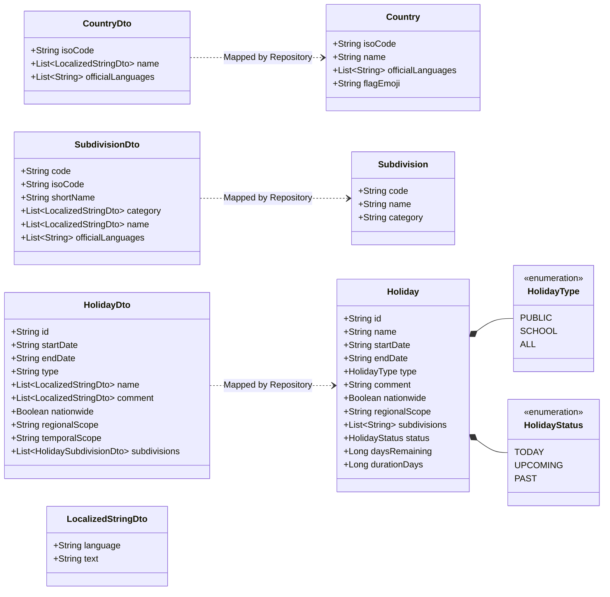

# Phase 6: Data Model Analysis

## 1. Class Diagram & Relationship Mapping



---

## 2. Granular Data Model Specifications

### 1. Data Transfer Objects (DTO Layer)

#### `LocalizedStringDto`
- **Fields**:
  - `language: String?`: 2-letter ISO language code (e.g. `"EN"`, `"DE"`).
  - `text: String?`: The localized text string.

#### `CountryDto`
- **Fields**:
  - `isoCode: String`: Country ISO-3166-1 alpha-2 code (e.g. `"DE"`, `"US"`).
  - `name: List<LocalizedStringDto>?`: Array of localized country names.
  - `officialLanguages: List<String>?`: Array of official ISO language codes.

#### `SubdivisionDto`
- **Fields**:
  - `code: String`: Unique subdivision code (e.g. `"DE-BY"`).
  - `isoCode: String?`: Subdivision ISO code.
  - `shortName: String?`: Abbreviated name (e.g. `"BY"`).
  - `category: List<LocalizedStringDto>?`: Localized administrative category (e.g. `"State"`).
  - `name: List<LocalizedStringDto>?`: Localized subdivision name (e.g. `"Bavaria"`).
  - `officialLanguages: List<String>?`: Official regional languages.

#### `HolidayDto`
- **Fields**:
  - `id: String?`: Unique holiday UUID.
  - `startDate: String`: Format `yyyy-MM-dd`.
  - `endDate: String`: Format `yyyy-MM-dd`.
  - `type: String?`: String type (e.g. `"Public"`, `"School"`).
  - `name: List<LocalizedStringDto>?`: Localized holiday title.
  - `comment: List<LocalizedStringDto>?`: Localized descriptive notes.
  - `nationwide: Boolean?`: Whether applicable nationwide.
  - `regionalScope: String?`: e.g. `"National"`, `"Regional"`.
  - `temporalScope: String?`: e.g. `"FullDay"`, `"HalfDay"`.
  - `subdivisions: List<HolidaySubdivisionDto>?`: Affected administrative subdivisions.

---

### 2. Domain Entities Layer

#### `Country`
```kotlin
data class Country(
    val isoCode: String,
    val name: String,
    val officialLanguages: List<String> = emptyList(),
    val flagEmoji: String = getCountryFlagEmoji(isoCode)
)
```

#### `Subdivision`
```kotlin
data class Subdivision(
    val code: String,
    val name: String,
    val category: String = ""
)
```

#### `Holiday`
```kotlin
data class Holiday(
    val id: String,
    val name: String,
    val startDate: String, // yyyy-MM-dd
    val endDate: String,   // yyyy-MM-dd
    val type: HolidayType,
    val comment: String? = null,
    val nationwide: Boolean = true,
    val regionalScope: String? = null,
    val subdivisions: List<String> = emptyList(),
    val status: HolidayStatus = HolidayStatus.UPCOMING,
    val daysRemaining: Long? = null,
    val durationDays: Long = 1
)
```

---

### 3. UI State Model

#### `HolidayUiState`
```kotlin
data class HolidayUiState(
    val isLoadingCountries: Boolean = false,
    val isLoadingHolidays: Boolean = false,
    val countries: List<Country> = emptyList(),
    val selectedCountry: Country? = null,
    val subdivisions: List<Subdivision> = emptyList(),
    val selectedSubdivision: Subdivision? = null,
    val selectedYear: Int = DateUtils.getCurrentYear(),
    val selectedTab: HolidayType = HolidayType.ALL,
    val searchQuery: String = "",
    val rawHolidays: List<Holiday> = emptyList(),
    val filteredHolidays: List<Holiday> = emptyList(),
    val nextHoliday: Holiday? = null,
    val selectedHolidayDetails: Holiday? = null,
    val errorMessage: String? = null
)
```

---

## 3. Data Mapping & Normalization Rules

1. **Language Normalization**: Remote localized strings are evaluated with priority: `requestedLanguage -> "EN" -> firstAvailable -> fallback`.
2. **Flag Emoji Enrichment**: `Country` automatically generates its `flagEmoji` using character bitshift operations on the 2-letter ISO code.
3. **Status & Duration Computed Properties**: `Holiday` domain models pre-calculate `durationDays`, `status` (`TODAY`, `UPCOMING`, `PAST`), and `daysRemaining` at parsing time.
4. **Offline Strategy**: In Flutter target, models can be serialized to JSON and stored in `shared_preferences` or `Hive` / `Isar` for instant offline availability.
