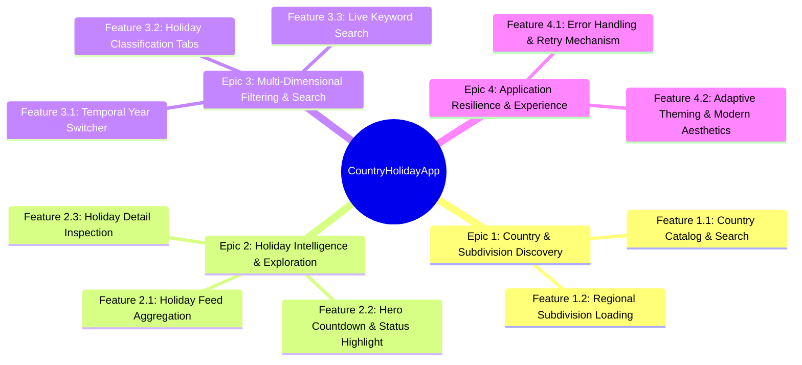

# Phase 7: Epics & Features Breakdown

## 1. Epics Hierarchy

---

## 2. Epics & Features Catalog

### EPIC-01: Country & Subdivision Discovery
- **Summary**: Enable users to discover and select sovereign countries and their internal administrative subdivisions.
- **Features**:
  - **FEAT-1.1: Country Catalog & Search**: Fetch supported countries, display flag emojis, provide search modal with real-time substring filtering, and select default country (DE/US/first).
  - **FEAT-1.2: Regional Subdivision Loading**: Dynamically fetch and display administrative states/provinces/cantons as interactive chips upon country selection.

---

### EPIC-02: Holiday Intelligence & Exploration
- **Summary**: Aggregate, process, deduplicate, and display comprehensive public and school holiday data.
- **Features**:
  - **FEAT-2.1: Holiday Feed Aggregation**: Concurrent retrieval and merging of statutory public holidays and academic school holidays with deduplication and chronological ordering.
  - **FEAT-2.2: Hero Countdown & Status Highlight**: Promote the next upcoming holiday with remaining days countdown badge or "TODAY" celebration indicator.
  - **FEAT-2.3: Holiday Detail Inspection**: Display rich metadata in a modal bottom sheet including dates, total days duration, geographical coverage, and localized notes.

---

### EPIC-03: Multi-Dimensional Filtering & Search
- **Summary**: Provide fast, responsive filtering tools to inspect specific years, categories, regions, and search terms.
- **Features**:
  - **FEAT-3.1: Temporal Year Switcher**: Toggle across calendar years (2024–2027) with dynamic date range computation.
  - **FEAT-3.2: Holiday Classification Tabs**: Segmented tab control filtering between All, Public, and School holidays.
  - **FEAT-3.3: Live Keyword Search**: Real-time client-side substring search against holiday names and descriptive notes.

---

### EPIC-04: Application Resilience & Experience
- **Summary**: Ensure graceful degradation, clear error states, fast retry loops, and clean cross-platform aesthetics.
- **Features**:
  - **FEAT-4.1: Error Handling & Retry**: Graceful UI error reporting on network failure with an instant retry action.
  - **FEAT-4.2: Adaptive Cross-Platform Design**: Responsive layout supporting Mobile (Android/iOS) and Web with coherent Material 3 aesthetics.
