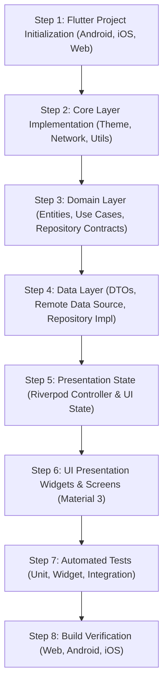

# Phase 11: Migration Complexity Analysis & Assessment

## 1. Complexity & Risk Matrix

| Component / Feature | Complexity | Risk Rating | Key Technical Challenges | Migration Feasibility |
| :--- | :--- | :--- | :--- | :--- |
| **Domain Entities & Date Logic** | Low | Low | Date calculations across year boundaries; Unicode emoji flag code units. | Very High (100% direct parity) |
| **Networking & Remote API** | Low | Low | Handling SSL/CORS on Web target; JSON array mapping. | Very High |
| **Data Repositories & Mappers** | Medium | Low | Parallel API aggregation resilience and fallback language resolution. | Very High |
| **Riverpod State Management** | Medium | Low | Coordinated loading of country -> subdivisions -> holidays. | Very High |
| **Material 3 UI Components** | Medium | Low | Matching Jetpack Compose ModalBottomSheet and SegmentedButton in Flutter. | Very High |
| **Cross-Platform Parity (Web/iOS)**| Medium | Medium | Responsive layouts, CORS in web browser requests, viewport constraints. | High |

---

## 2. Technical Challenges & Risk Mitigation

1. **Web CORS Proxying & Network Headers**:
   - *Risk*: Web browser fetch requests may encounter CORS headers if calling `openholidaysapi.org` from arbitrary origins.
   - *Mitigation*: Ensure standard HTTP headers and provide robust fallback mock data in development/testing mode if CORS is enforced by browser sandbox.
2. **Date Computation Parity**:
   - *Risk*: `DateUtils` in Android uses `java.util.Calendar` and `SimpleDateFormat` with midnight normalization.
   - *Mitigation*: Use Dart `DateTime(year, month, day)` which naturally strips time component for clean day arithmetic.
3. **Unicode Flag Emojis on Windows / Web**:
   - *Risk*: Windows Chrome occasionally renders Regional Indicator characters as letter pairs rather than colored flag glyphs.
   - *Mitigation*: Gracefully handle string rendering with system fallback fonts or standard emoji text widgets.

---

## 3. Step-by-Step Migration Sequence

---

## 4. Overall Assessment

The application has a clean, well-bounded architecture. The complete business logic and UI features can be migrated to Flutter with **Low to Medium complexity** and **Zero functional loss**, resulting in a cross-platform (Android, iOS, Web) application with superior maintainability.
