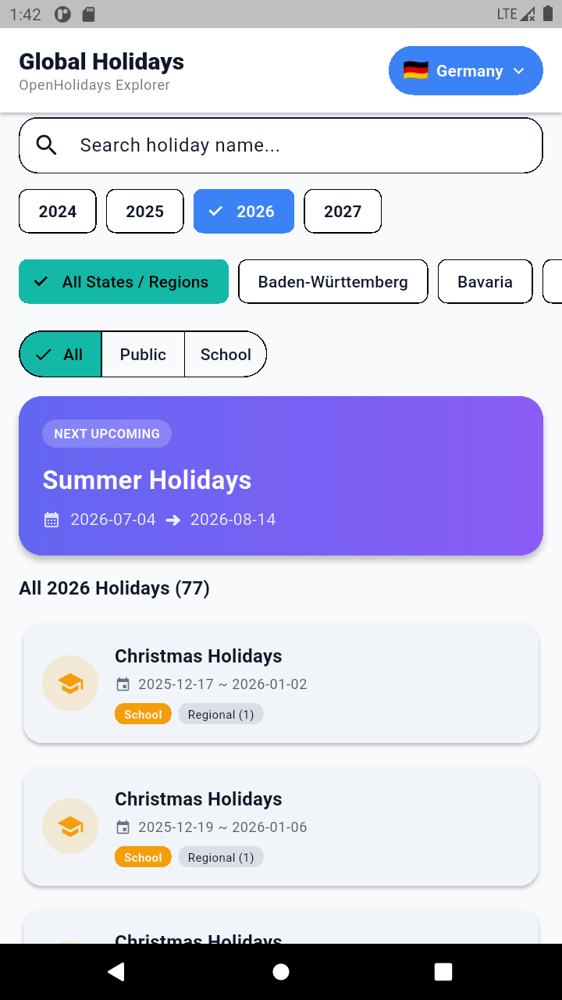

# Global Holidays - OpenHolidays Explorer

A modern, high-performance Flutter application for discovering and exploring public and school holidays across global countries and regions, powered by the [OpenHolidays API](https://openholidaysapi.org/).

---

## 📱 App Preview



---

## ✨ Features

- 🌍 **Global Country Selection**: Browse holidays for various supported countries (e.g., Germany, Austria, Switzerland, etc.).
- 🔍 **Real-Time Holiday Search**: Instant name and text filtering across all holidays.
- 📅 **Multi-Year Navigation**: Seamlessly switch between years (2024, 2025, 2026, 2027+).
- 🏛️ **Subdivision & Region Filters**: Filter by states/provinces (e.g., Baden-Württemberg, Bavaria).
- 🏷️ **Category Filtering**: Toggle between **All**, **Public**, and **School** holiday types.
- 🌟 **Next Upcoming Holiday Banner**: Dynamic hero highlight banner displaying the immediate next upcoming holiday with date ranges.
- 📱 **Clean & Modern UI**: Built with Material Design 3 and responsive layouts.

---

## 📚 Project Documentation

The project includes an in-depth reverse-engineering, architecture, and migration documentation suite:

| Document | Phase | Description |
| :--- | :--- | :--- |
| [01_architecture_assessment.md](01_architecture_assessment.md) | Phase 1 | **Application Discovery & Architecture Assessment** — Executive summary, native architecture review, technology stack, and high-level data flows. |
| [02_module_inventory.md](02_module_inventory.md) | Phase 2 | **Module Inventory** — Physical module structure, layer boundaries, dependency graph, and package organization. |
| [03_screen_inventory.md](03_screen_inventory.md) | Phase 3 | **Screen Inventory** — Screen catalog, UI components, dialogs/bottom sheets, and user navigation flow. |
| [04_business_rules.md](04_business_rules.md) | Phase 4 | **Business Rule Extraction** — Domain logic, filtering rules, upcoming holiday calculation, and validation constraints. |
| [05_api_inventory.md](05_api_inventory.md) | Phase 5 | **API Inventory** — OpenHolidays API endpoints, query parameters, response structures, and error handling. |
| [06_data_models.md](06_data_models.md) | Phase 6 | **Data Model Analysis** — Class diagrams, entity relationships, and JSON serialization models. |
| [07_epics.md](07_epics.md) | Phase 7 | **Epics & Features Breakdown** — Epics hierarchy, functional capabilities, and feature scope. |
| [08_user_stories.md](08_user_stories.md) | Phase 7/8 | **Detailed User Stories Backlog** — Comprehensive user stories (US-01 through US-08) with acceptance criteria. |
| [09_test_cases.md](09_test_cases.md) | Phase 8 | **Test Case Specifications** — Unit, widget, and integration test scenarios covering core workflows and edge cases. |
| [10_flutter_architecture.md](10_flutter_architecture.md) | Phase 9 | **Flutter Target Architecture** — Target clean architecture blueprint, feature-first structure, and Riverpod state management. |
| [11_android_flutter_mapping.md](11_android_flutter_mapping.md) | Phase 10 | **Android to Flutter Mapping** — Paradigm mapping table translating native Android components to Flutter equivalents. |
| [12_migration_assessment.md](12_migration_assessment.md) | Phase 11 | **Migration Complexity Analysis & Assessment** — Complexity matrix, risk ratings, technical challenges, and migration roadmap. |

---

## 🛠️ Tech Stack & Architecture

- **Framework**: [Flutter](https://flutter.dev/) (Dart SDK ^3.12.2)
- **State Management**: [Riverpod](https://riverpod.dev/) (`flutter_riverpod: ^2.6.1`)
- **Networking**: [Dio](https://pub.dev/packages/dio) (`dio: ^5.8.0+1`)
- **Routing**: [GoRouter](https://pub.dev/packages/go_router) (`go_router: ^14.8.1`)
- **Formatting & Localization**: [Intl](https://pub.dev/packages/intl) (`intl: ^0.20.2`)
- **Architecture**: Clean Architecture with Feature-First Modularization (`data`, `domain`, `presentation`)

---

## 🚀 Getting Started

### Prerequisites

- [Flutter SDK](https://docs.flutter.dev/get-started/install) installed
- An active Android/iOS emulator or connected device

### Installation & Run

1. **Clone the repository**:
   ```bash
   git clone <repository-url>
   cd CountryHolidayFlutterApp
   ```

2. **Install dependencies**:
   ```bash
   flutter pub get
   ```

3. **Run the app**:
   ```bash
   flutter run
   ```

4. **Run tests**:
   ```bash
   flutter test
   ```
